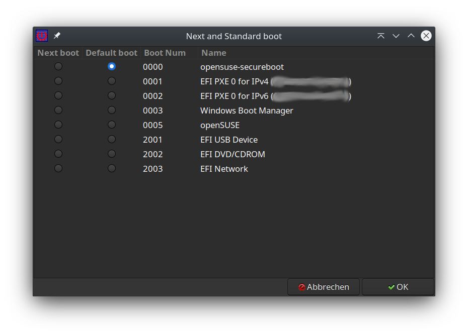

# EFIGuiScript

## Desctiption

The script is build on a openSUSE Thumbleweed with KDE running.

It's possible it runs also on other window manager like gnome.
The script helps you to choos easy from desktop to choose on a UEFI System the next boot and the standad boot system.

## Dependencies 

I run it with the following tools it can run also with other versions but it's not tested with it-
bash        - as script language version 5.0.17(1)-release
efimanager  - version 14
yad         - release 0.36.2 (GTK+ 3.24.21)

## Recomandation for running it

You should prepera a sudoer entrie in /etc/sudoers life follow
<user> ALL = (root) NOPASSWD:/usr/sbin/efibootmgr
  
where <user> is your loggin user.
 
 The script calls "sudo /usr/bin/efibootmgr" to set and read the option.
 
### Open for improvements
 
actual the reboot event is given only of a kde desktop is available you can cancel it how you can do it under kde regulry.
as i don't have actual a gnome system i could not test a version working for gnome
 
If you know some userfull extension please make a sugestion 

### Screen Shots

#### After start you will get a screen for the next boot and standad boot to choose
On <ESC> you can leave without any changes.
On <RETURN> you apply change.

## Changes

* v0.2 -> v0.3  date 26.Jul 2020
    1. change from tool zenity to yad 
    2. change from ksh to bash
    3. make single gui no more 2 gui's to handle
    4. add application icon
    
    

                    
